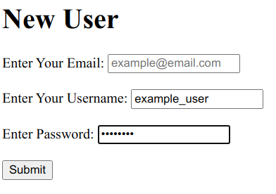

# Re-former (Forms project)

> This is a mini-project that allows you to add new users and edit the user details using forms

> It uses different methods for implementation of forms and uses 'Active Record' to validate the form



## Built With

- Ruby
- Ruby on Rails
- SQLite
- Atom
- VS Code

### Getting Started

### Prerequisites

To get this project up and running locally, you must have installed, ruby, rails and the necessary gems.

**To get this project set up on your local machine, follow these simple steps:**

1. Open Terminal.
2. Navigate to your desired location to download the contents of this repository.
3. Copy and paste the following code into the Terminal: git clone https://github.com/newhorizon-tech/re-former
4. Run ```cd re-former```.
5. Run ```bundle install``` to get the necesary gems.
6. Run `rails db:migrate`.

## Usage

- Navigate to the root directory of the project
- Run `rails server`
- Open a browser and visit `www.127.0.0.1.com/users/new` to create a new user
- Open a browser and visit `www.127.0.0.1.com/users/1/edit` to edit a user (with id 1)


## Authors

👤 **Alaukik**

- Github: [@newhorizon-tech](https://github.com/newhorizon-tech)
- Twitter: [@techintosh3](https://twitter.com/techintosh3)

👤 **Oguadinma Nkiruka Ngozika**

-   Github: [@enkog](https://github.com/enkog)
-   Linkedin: [@enkog](https://www.linkedin.com/in/enkog/)
-   Twitter: [@enkodes](https://twitter.com/enkodes)

## Acknowledgements

- Microverse for showing the way for this project to happen.
- Odin Projects for outlining a clear roadmap to the project requirements.
- Official Rails Guide https://guides.rubyonrails.org/

## 🤝 Contributing

Contributions, issues, and feature requests are welcome!

Feel free to check the [issues page](https://github.com/newhorizon-tech/re-former/issues).

## Show your support

Give a ⭐️ if you like this project!
